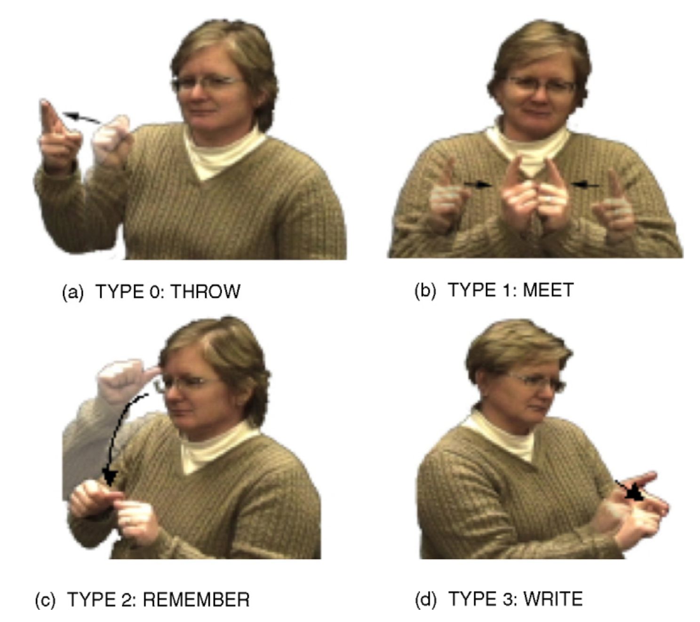
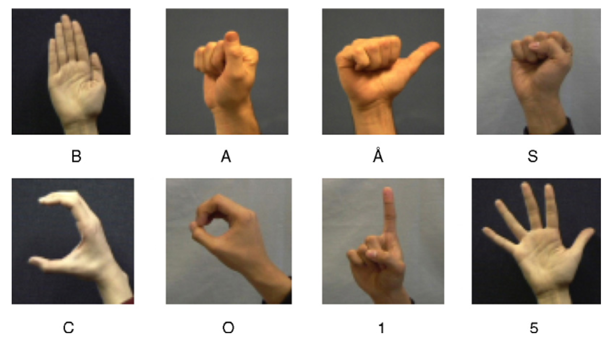

# To Do

## Poses

Ich benötige die folgenden beiden Gebärden dargestellt mit eingezeichneten Winkeln zwischen Ober- und Unterarm, sowie Oberarm und Gravitationskraft:

- [x] Cool
- [x] Horse

## [Battison](https://citeseerx.ist.psu.edu/viewdoc/download?doi=10.1.1.582.7797&rep=rep1&type=pdf)'s four types of signs

Im folgenden handelt es sich um vier Gebärden, wobei ich dieses mal keine Bones und Winkel brauche, dafür eine Visualisierung der Bewegung. Die Gebärden mit Beispielbilder sind:

Passende Videos hab ich dir unten in der Liste verlinkt.
Bei dem Bild mit den vier Gebärden will ich folgendes verdeutlichen:

- [x] one-handed signs—e.g., [THROW](https://asl-lex.org/visualization/?sign=throw)
- [x] two active hands with the same handshape performing the same movement (synchronized or alternating)—e.g., [MEET](https://asl-lex.org/visualization/?sign=meet)
- [x] two-handed signs with one active and one passive hand, both with the same handshape—e.g., [REMEMBER](https://asl-lex.org/visualization/?sign=remember) (die zweite Hand sollte sich meiner Meinung nach nicht bewegen, also so wie [hier](https://www.signingsavvy.com/search/remember))
- [x] two-handed signs with an active and a passive hand, each having a different handshape—e.g., [WRITE](https://asl-lex.org/visualization/?sign=write)

## Unmarked Handshapes

Das Bild zeigt 8 Handformen, die ich modelliert benötige, wie im Bild zu sehen. Einzig das „a“ würde ich nicht gedreht sondern frontaler zeigen, ähnlich wie es bei „å“ zu sehen ist.

- [x] b_contact
- [x] a
- [x] a_open (å)
- [ ] s
- [x] c
- [x] o
- [x] 1
- [x] 5

## Handshapes

xfun::embed_file("handshapes.pdf")

- [x] a
- [x] a_open
- [ ] b_closed
- [ ] b_open
- [ ] b_flat
- [x] c
- [ ] d
- [ ] e
- [ ] e_closed
- [ ] e_open
- [ ] e_open_spread
- [ ] e_spread
- [ ] f and 9
- [ ] f_open
- [ ] g and q
- [ ] h and u
- [ ] h_curved
- [ ] h_flat
- [ ] h_open
- [ ] i
- [ ] j
- [ ] k and p
- [ ] l
- [ ] l_bent
- [ ] l_curved
- [ ] m
- [ ] m_flat
- [ ] n
- [ ] n_flat
- [x] o and 0
- [ ] o_baby
- [ ] o_flat
- [ ] r
- [ ] s
- [ ] t
- [ ] v and 2
- [ ] v_bent
- [ ] v_flat
- [ ] w and 6
- [ ] x
- [ ] y
- [ ] z
- [x] 1
- [ ] 1_bent
- [ ] 1_curved
- [ ] 1_flat
- [ ] 3
- [ ] 4
- [ ] 4_curved
- [ ] 5_curved
- [ ] 5_flat_spread
- [ ] 4_flat
- [x] 5
- [ ] 5_stacked
- [ ] 7
- [ ] 8
- [ ] 8_open
- [ ] goody_goody
- [ ] horns
- [ ] horns_flat
- [ ] ily
- [ ] ily_flat

## Anmerkung

Wichtig ist mir, dass alle Bilder in meiner Diss ähnlich sind, also nicht irgendwelche wild zusammen kopierten Fotos von Handformen und so. Daher hätte ich gerne immer den von dir modellierten Menschen bzw. die zugehörige Hand und idealerweise auch immer denselben Bildausschnitt/Position, weil das einfach viel mehr ausmacht (sieht super aus!!!)! Das wäre echt super, danke!!!
