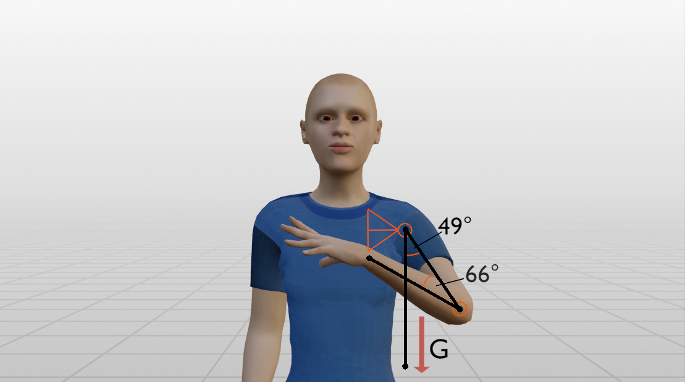
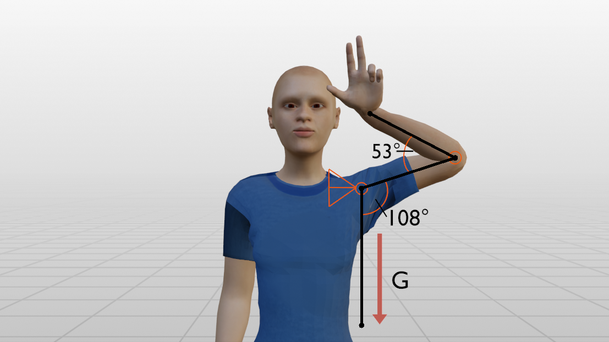
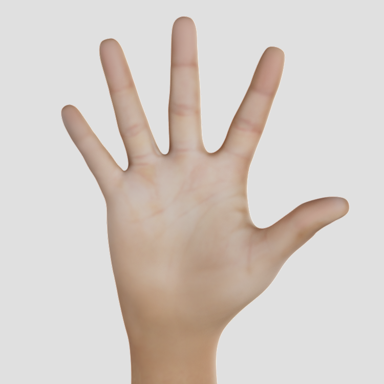
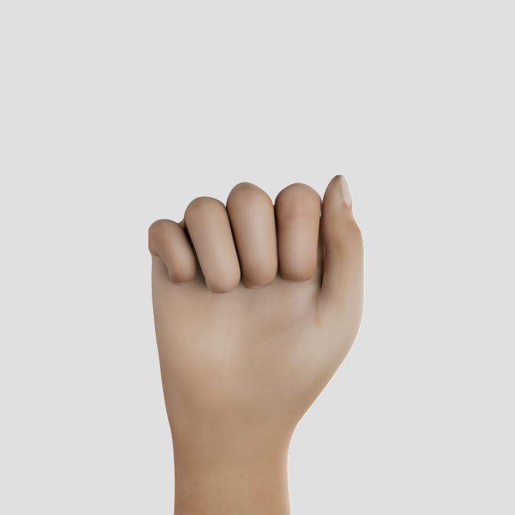
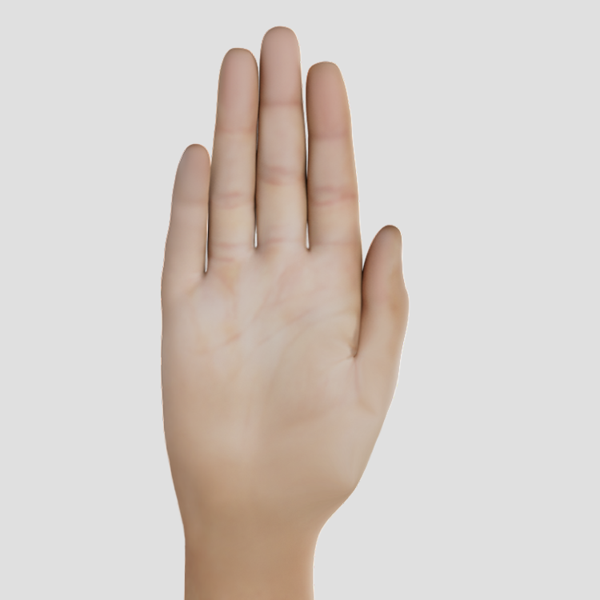
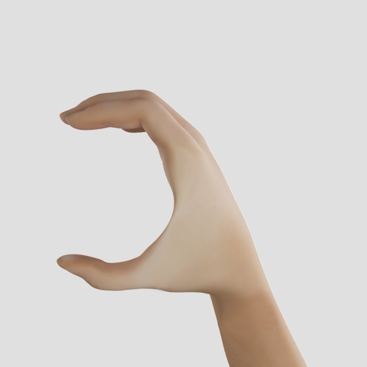
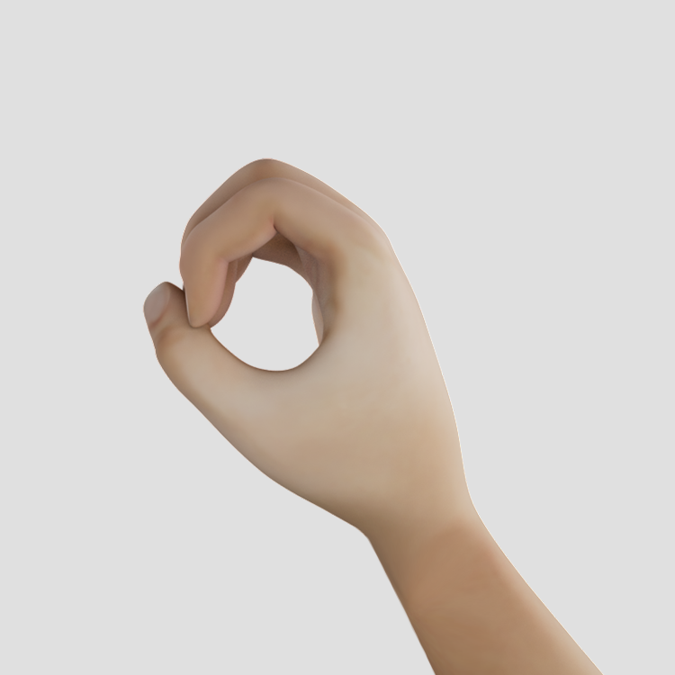
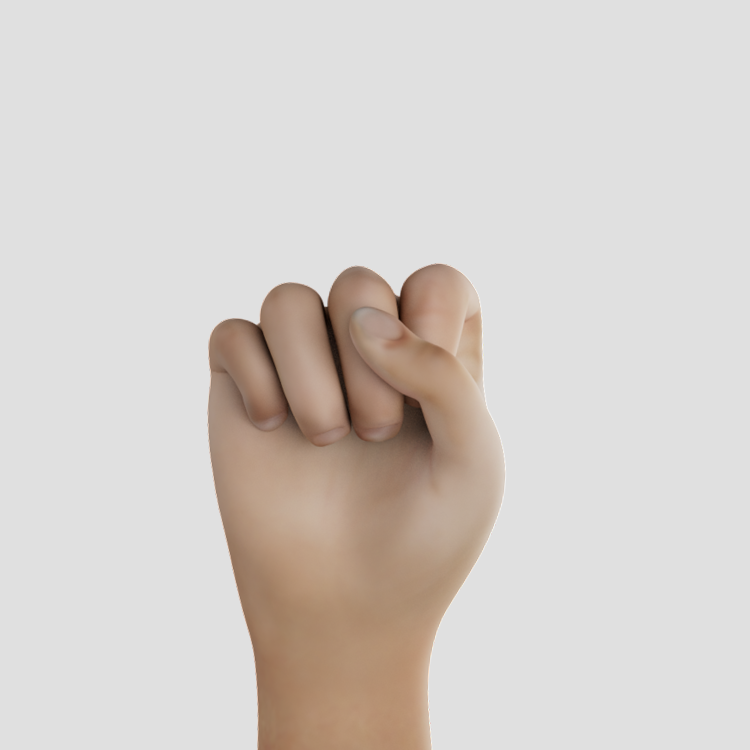

# Sign Visualizations

All visualizations presented here originate from American Sign Language (ASL) and were created for different research projects around sign language recognition.

## Poses

A few sample poses for the following signs of ASL:

<table>
  <tr>
    <td></td>
    <td></td>
   </tr>
  <tr>
    <td>Cool</td>
    <td>Horse</td>
   </tr>
</table>

## [Battison](https://citeseerx.ist.psu.edu/viewdoc/download?doi=10.1.1.582.7797&rep=rep1&type=pdf)'s four types of signs

According to Battison (1978), there are four different types of signs:

<table>
  <tr>
    <td></td>
    <td></td>
   </tr>
  <tr>
    <td>Type 0: one-handed signs—e.g., [THROW](https://asl-lex.org/visualization/?sign=throw)</td>
    <td>Type 1: two active hands with the same handshape performing the same movement (synchronized or alternating)—e.g., [MEET](https://asl-lex.org/visualization/?sign=meet</td>
   </tr>
  <tr>
    <td></td>
    <td></td>
   </tr>
  <tr>
    <td>Type 2: two-handed signs with one active and one passive hand, both with the same handshape—e.g., [REMEMBER](https://asl-lex.org/visualization/?sign=remember) ([Alternative](https://www.signingsavvy.com/search/remember))</td>
    <td>Type 3: two-handed signs with an active and a passive hand, each having a different handshape—e.g., [WRITE](https://asl-lex.org/visualization/?sign=write)</td>
   </tr>
</table>

## Handshapes

### Unmarked Handshapes

According to Battison (1978), the unmarked handshapes are those handshapes that are used by the non-dominant hand. They are also the handshapes that are learned first by children. More infos can be found [here](https://www.handspeak.com/learn/index.php?id=439).

<table>
  <tr>
    <td></td>
    <td></td>
    <td></td>
    <td></td>
   </tr>
  <tr>
    <td>1</td>
    <td>5</td>
    <td>a</td>
    <td>a_open</td>
   </tr>
  <tr>
    <td></td>
    <td></td>
    <td></td>
    <td></td>
   </tr>
  <tr>
    <td>b_contact</td>
    <td>c</td>
    <td>o</td>
    <td>s</td>
   </tr>
</table>

### Marked Handshapes

Marked Handshapes are all other handshapes.

<table>
  <tr>
    <td></td>
    <td></td>
    <td></td>
    <td></td>
   </tr>
  <tr>
    <td>b_closed</td>
    <td>b_flat</td>
    <td>b_open</td>
    <td>d</td>
  </tr>

  <tr>
    <td></td>
    <td></td>
    <td></td>
    <td></td>
   </tr>
  <tr>
    <td>e_closed</td>
    <td>e_open_spread</td>
    <td>e_open</td>
    <td>e_spread</td>
  </tr>
  
  <tr>
    <td></td>
    <td></td>
    <td></td>
    <td></td>
   </tr>
  <tr>
    <td>e</td>
    <td>f_open</td>
    <td>f</td>
    <td>g</td>
  </tr>
  
  <tr>
    <td></td>
    <td></td>
    <td></td>
    <td></td>
   </tr>
  <tr>
    <td>h_curved</td>
    <td>h_flat</td>
    <td>h_open</td>
    <td>h</td>
  </tr>
  
  <tr>
    <td></td>
    <td></td>
    <td></td>
    <td></td>
   </tr>
  <tr>
    <td>i</td>
    <td>j</td>
    <td>k</td>
    <td>l_bent</td>
  </tr>
  
  <tr>
    <td></td>
    <td></td>
    <td></td>
    <td></td>
   </tr>
  <tr>
    <td>l_curved</td>
    <td>l</td>
    <td>m_flat</td>
    <td>m</td>
  </tr>
  
  <tr>
    <td></td>
    <td></td>
    <td></td>
    <td></td>
   </tr>
  <tr>
    <td>n_flat</td>
    <td>n</td>
    <td>o_baby</td>
    <td>o_flat</td>
  </tr>
  
  <tr>
    <td></td>
    <td></td>
    <td></td>
    <td></td>
   </tr>
  <tr>
    <td>p</td>
    <td>q</td>
    <td>r</td>
    <td>t</td>
  </tr>
  
  <tr>
    <td></td>
    <td></td>
    <td></td>
    <td></td>
   </tr>
  <tr>
    <td>u</td>
    <td>v_bent</td>
    <td>v_flat</td>
    <td>v</td>
  </tr>
  
  <tr>
    <td></td>
    <td></td>
    <td></td>
    <td></td>
   </tr>
  <tr>
    <td>w</td>
    <td>x</td>
    <td>y</td>
    <td>z</td>
  </tr>

<tr>
    <td></td>
    <td></td>
    <td></td>
    <td></td>
   </tr>
  <tr>
    <td>0</td>
    <td>1_bent</td>
    <td>1_curved</td>
    <td>1_flat</td>
  </tr>

<tr>
    <td></td>
    <td></td>
    <td></td>
    <td></td>
   </tr>
  <tr>
    <td>2</td>
    <td>3</td>
    <td>4</td>
    <td>4_curved</td>
  </tr>

<tr>
    <td></td>
    <td></td>
    <td></td>
    <td></td>
   </tr>
  <tr>
    <td>4_flat</td>
    <td>5_curved</td>
    <td>5_flat_spread</td>
    <td>6</td>
  </tr>

<tr>
    <td></td>
    <td></td>
    <td></td>
    <td></td>
   </tr>
  <tr>
    <td>7</td>
    <td>8</td>
    <td>8_open</td>
    <td>9</td>
  </tr>

  <tr>
    <td></td>
    <td></td>
    <td></td>
    <td></td>
   </tr>
  <tr>
    <td>goody_goody</td>
    <td>horns</td>
    <td>horns_flat</td>
    <td>ily</td>
  </tr>

<tr>
    <td></td>
   </tr>
  <tr>
    <td>ily_flat</td>
  </tr>
</table>

- [x] 0 (like o)
- [x] 1_bent
- [x] 1_curved
- [x] 1_flat
- [x] 2 (like v)
- [x] 3
- [x] 4
- [x] 4_curved
- [x] 4_flat
- [x] 5_curved
- [x] 5_flat_spread
- [x] 5_stacked
- [x] 6 (like w)
- [x] 7
- [x] 8
- [x] 8_open
- [x] 9 (like f)
- [x] goody_goody
- [x] horns
- [x] horns_flat
- [x] ily
- [x] ily_flat
