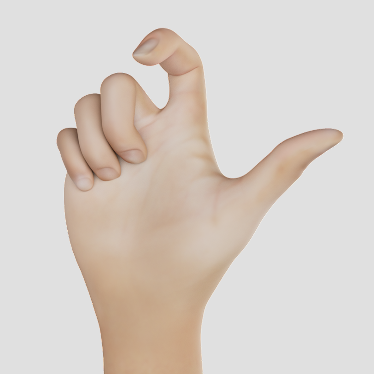
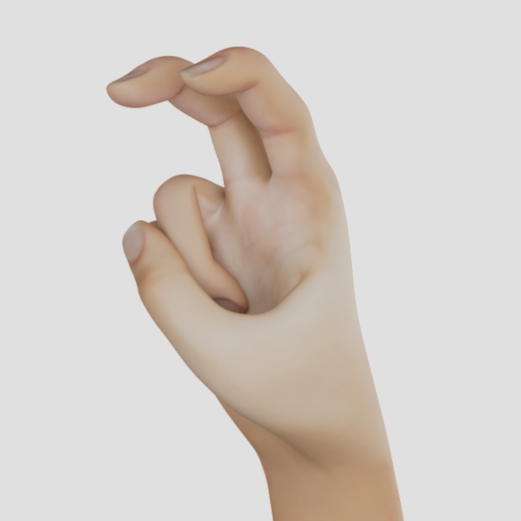

# Sign Visualizations

All visualizations presented here were created for various sign language recognition research projects and are taken from American Sign Language (ASL) unless otherwise noted.

The graphics can be used freely as long as this repository and the authors (Achenbach, Philipp and Fohrmann, Katharina and Volkov, Ilya, 2022) are referenced.

## Poses

A few sample poses for the following signs of ASL:

<table>
  <tr>
    <td></td>
    <td></td>
   </tr>
  <tr>
    <td>Cool</td>
    <td>Horse</td>
   </tr>
</table>

## [Battison](https://citeseerx.ist.psu.edu/viewdoc/download?doi=10.1.1.582.7797&rep=rep1&type=pdf)'s four types of signs

According to Battison (1978) [[1]](#1), there are four different types of signs:

<table>
  <tr>
    <td></td>
    <td></td>
   </tr>
  <tr>
    <td>Type 0: One-handed signs—e.g., [THROW](https://asl-lex.org/visualization/?sign=throw)</td>
    <td>Type 1: Two active hands with the same handshape performing the same movement (synchronized or alternating)—e.g., [MEET](https://asl-lex.org/visualization/?sign=meet</td>
   </tr>
  <tr>
    <td></td>
    <td></td>
   </tr>
  <tr>
    <td>Type 2: Two-handed signs with one active and one passive hand, both with the same handshape—e.g., [REMEMBER](https://asl-lex.org/visualization/?sign=remember) ([Alternative](https://www.signingsavvy.com/search/remember))</td>
    <td>Type 3: Two-handed signs with an active and a passive hand, each having a different handshape—e.g., [WRITE](https://asl-lex.org/visualization/?sign=write)</td>
   </tr>
</table>

Battison (1978) [[1]](#1) also established two combination rules for the hands that are valid for all sign languages:

- **Symmetry** rule: If both hands move at the same time, they have the same hand shape (Type 1).
- **Dominance** rule: If the dominant and non-dominant hands have different handshapes, only the dominant hand moves and the non-dominant hand has one of the [#unmarked-handshapes] (Type 3).

## Handshapes

### Unmarked Handshapes

According to Battison (1978) [[1]](#1), the unmarked handshapes are those handshapes used by the non-dominant hand. They are also the handshapes first learned by children and are used in all known sign languages. For more information, see [here] (https://www.handspeak.com/learn/index.php?id=439).

Depending on the source, six [[2]](#2), seven [[1]](#1) or eight [[3]](#3) different gestures are mentioned.

<table>
  <tr>
    <td></td>
    <td></td>
    <td></td>
    <td></td>
   </tr>
  <tr>
    <td>1</td>
    <td>5</td>
    <td>a</td>
    <td>a_open2</td>
   </tr>
  <tr>
    <td></td>
    <td></td>
    <td></td>
    <td></td>
   </tr>
  <tr>
    <td>b_contact</td>
    <td>c</td>
    <td>o</td>
    <td>s1</td>
   </tr>
</table>

\* Boyes Braem [[2]](#2) considers handshape _s_ as a variation of handshape _a_ and therefore does not differentiate it further.

\*\* Eccarius and Brentari [[3]](#3) differentiated handshape _a_ and therefore introduced the further gesture _a_open_.

### Used Handshapes in _American Sign Language_

According to [ASL-Lex](https://asl-lex.org) the following 59 handshapes are used in ASL:

<table>
  <tr>
    <td></td>
    <td></td>
    <td></td>
    <td></td>
   </tr>
  <tr>
    <td>1_bent</td>
    <td>1_curved</td>
    <td>1_flat</td>
    <td>1</td>
  </tr>

  <tr>
    <td></td>
    <td></td>
    <td></td>
    <td></td>
   </tr>
  <tr>
    <td>3</td>
    <td>4_curved</td>
    <td>4_flat</td>
    <td>4</td>
  </tr>

  <tr>
    <td></td>
    <td></td>
    <td></td>
    <td></td>
   </tr>
  <tr>
    <td>5_curved</td>
    <td>5_flat_spread</td>
    <td>5_stacked</td>
    <td>5</td>
  </tr>

  <tr>
    <td></td>
    <td></td>
    <td></td>
    <td></td>
   </tr>
  <tr>
    <td>7</td>
    <td>8_open</td>
    <td>8</td>
    <td>a</td>
  </tr>

  <tr>
    <td></td>
    <td></td>
    <td></td>
    <td></td>
   </tr>
  <tr>
    <td>b_closed</td>
    <td>b_flat</td>
    <td>b_open</td>
    <td>c</td>
  </tr>

  <tr>
    <td></td>
    <td></td>
    <td></td>
    <td></td>
   </tr>
  <tr>
    <td>d</td>
    <td>e_closed</td>
    <td>e_open_spread</td>
    <td>e_open</td>
  </tr>

  <tr>
    <td></td>
    <td></td>
    <td></td>
    <td></td>
   </tr>
  <tr>
    <td>e_spread</td>
    <td>e</td>
    <td>f_open</td>
    <td>f</td>
  </tr>

  <tr>
    <td></td>
    <td></td>
    <td></td>
    <td></td>
   </tr>
  <tr>
    <td>g</td>
    <td>goody_goody</td>
    <td>h_curved</td>
    <td>h_flat</td>
  </tr>

  <tr>
    <td></td>
    <td></td>
    <td></td>
    <td></td>
   </tr>
  <tr>
    <td>h_open</td>
    <td>h</td>
    <td>horns_flat</td>
    <td>horns</td>
  </tr>

  <tr>
    <td></td>
    <td></td>
    <td></td>
    <td></td>
   </tr>
  <tr>
    <td>i</td>
    <td>ily_flat</td>
    <td>ily</td>
    <td>k</td>
  </tr>

  <tr>
    <td></td>
    <td></td>
    <td></td>
    <td></td>
   </tr>
  <tr>
    <td>l_bent</td>
    <td>l_curved</td>
    <td>l</td>
    <td>m_flat</td>
  </tr>

  <tr>
    <td></td>
    <td></td>
    <td></td>
    <td></td>
   </tr>
  <tr>
    <td>n_flat</td>
    <td>n</td>
    <td>o_baby</td>
    <td>o_flat</td>
  </tr>

  <tr>
    <td></td>
    <td></td>
    <td></td>
    <td></td>
   </tr>
  <tr>
    <td>o</td>
    <td>p</td>
    <td>r</td>
    <td>s</td>
  </tr>

  <tr>
    <td></td>
    <td></td>
    <td></td>
    <td></td>
   </tr>
  <tr>
    <td>t</td>
    <td>v_bent</td>
    <td>v_curved</td>
    <td>v_flat</td>
  </tr>

  <tr>
    <td></td>
    <td></td>
    <td></td>
   </tr>
  <tr>
    <td>v</td>
    <td>w</td>
    <td>y</td>
  </tr>
</table>

### Used Handshapes in _American Fingeralphabet_

<table>
  <tr>
    <td></td>
    <td></td>
    <td></td>
    <td></td>
   </tr>
  <tr>
    <td>a</td>
    <td>b</td>
    <td>c</td>
    <td>d</td>
  </tr>

  <tr>
    <td></td>
    <td></td>
    <td></td>
    <td></td>
   </tr>
  <tr>
    <td>e</td>
    <td>f</td>
    <td>g</td>
    <td>h</td>
  </tr>

  <tr>
    <td></td>
    <td></td>
    <td></td>
    <td></td>
   </tr>
  <tr>
    <td>i</td>
    <td>j</td>
    <td>k</td>
    <td>l</td>
  </tr>

  <tr>
    <td></td>
    <td></td>
    <td></td>
    <td></td>
   </tr>
  <tr>
    <td>m</td>
    <td>n</td>
    <td>o</td>
    <td>p</td>
  </tr>

  <tr>
    <td></td>
    <td></td>
    <td></td>
    <td></td>
   </tr>
  <tr>
    <td>q</td>
    <td>r</td>
    <td>s</td>
    <td>t</td>
  </tr>

  <tr>
    <td></td>
    <td></td>
    <td></td>
    <td></td>
   </tr>
  <tr>
    <td>u</td>
    <td>v</td>
    <td>w</td>
    <td>x</td>
  </tr>

  <tr>
    <td></td>
    <td></td>
   </tr>
  <tr>
    <td>y</td>
    <td>z</td>
  </tr>
</table>

### Used Handshapes in _German Sign Language_

... to be done ...

### Used Handshapes in _German Fingeralphabet_

<table>
  <tr>
    <td></td>
    <td></td>
    <td></td>
    <td></td>
   </tr>
  <tr>
    <td>a</td>
    <td>b</td>
    <td>c</td>
    <td>d</td>
  </tr>

  <tr>
    <td></td>
    <td></td>
    <td></td>
    <td></td>
   </tr>
  <tr>
    <td>e</td>
    <td>f</td>
    <td>g</td>
    <td>h</td>
  </tr>

  <tr>
    <td></td>
    <td></td>
    <td></td>
    <td></td>
   </tr>
  <tr>
    <td>i</td>
    <td>j</td>
    <td>k</td>
    <td>l</td>
  </tr>

  <tr>
    <td></td>
    <td></td>
    <td></td>
    <td></td>
   </tr>
  <tr>
    <td>m</td>
    <td>n</td>
    <td>o</td>
    <td>p</td>
  </tr>

  <tr>
    <td></td>
    <td></td>
    <td></td>
    <td></td>
   </tr>
  <tr>
    <td>q</td>
    <td>r</td>
    <td>s</td>
    <td>t</td>
  </tr>

  <tr>
    <td></td>
    <td></td>
    <td></td>
    <td></td>
   </tr>
  <tr>
    <td>u</td>
    <td>v</td>
    <td>w</td>
    <td>x</td>
  </tr>

  <tr>
    <td></td>
    <td></td>
    <td></td>
    <td></td>
   </tr>
  <tr>
    <td>y</td>
    <td>z</td>
    <td>sch</td>
    <td>ß</td>
  </tr>

  <tr>
    <td></td>
    <td></td>
    <td></td>
   </tr>
  <tr>
    <td>ä</td>
    <td>ö</td>
    <td>ü</td>
  </tr>
</table>

## References

<a id="1">[1]</a>
Battison, Robbin. "Lexical borrowing in American sign language." (1978).

<a id="2">[2]</a>
Boyes Braem, Penny. "Einführung in die Gebärdensprache und ihre Erforschung, Hamburg: Signum-Verlag. 1995, 3." (1995).

<a id="3">[3]</a>
Eccarius, Petra, and Diane Brentari. "Symmetry and dominance: A cross-linguistic study of signs and classifier constructions." Lingua 117.7 (2007): 1169-1201.
