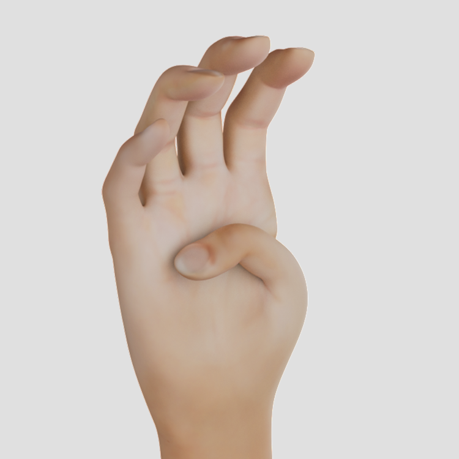
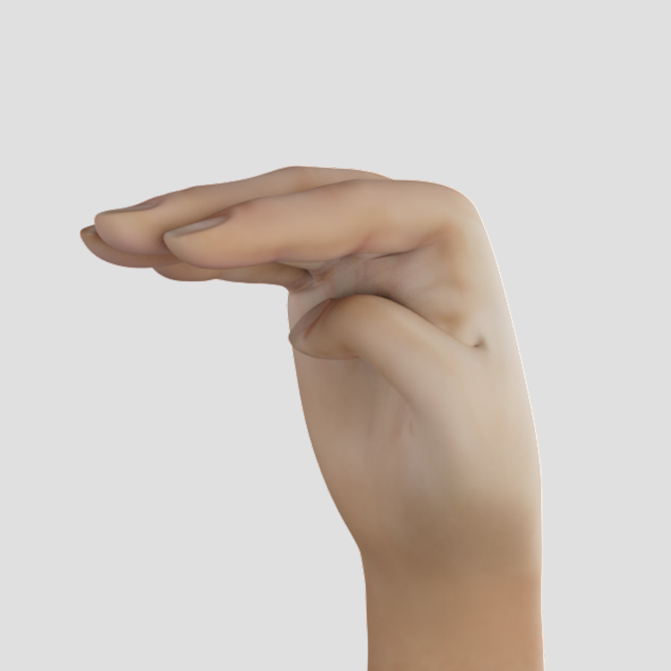
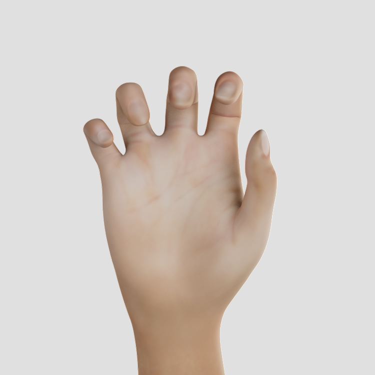
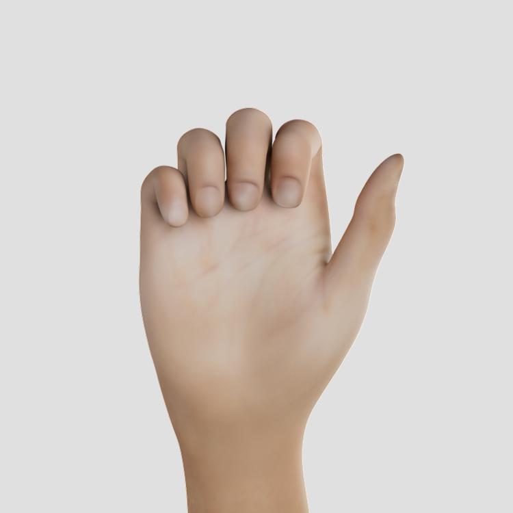
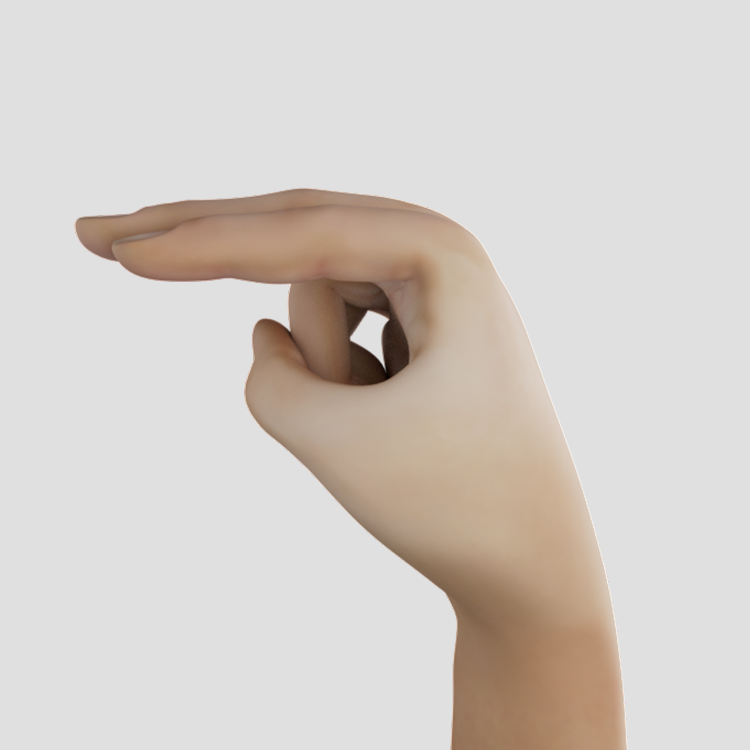
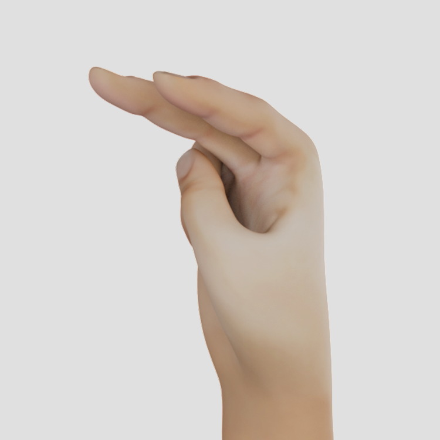
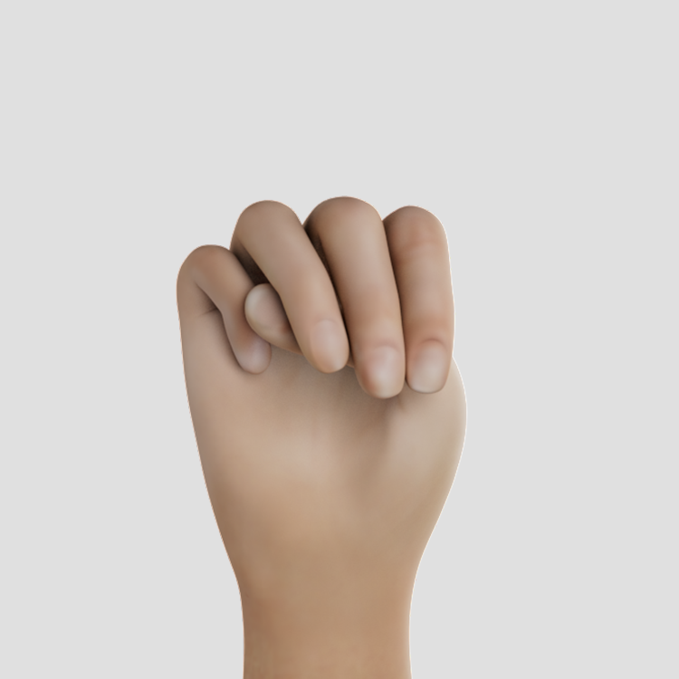
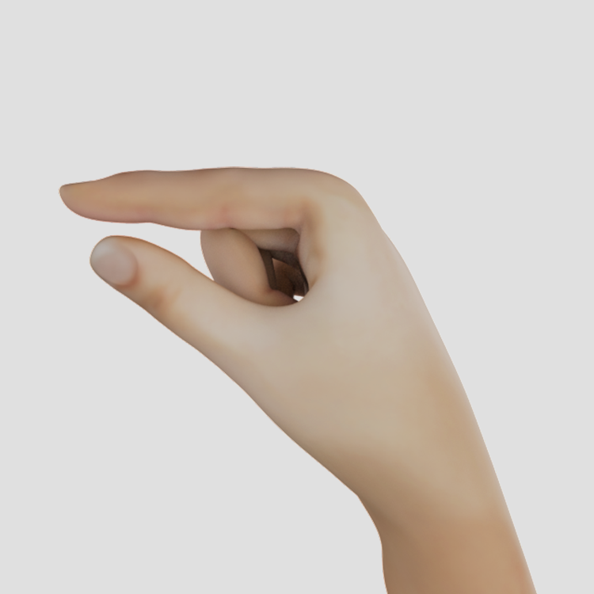
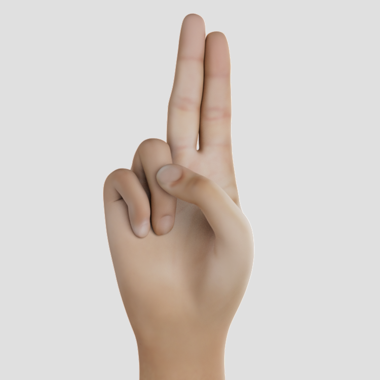

# Handshapes

## Unmarked Handshapes

According to Battison (1978) [[1]](#1), the unmarked handshapes are those handshapes used by the non-dominant hand. They are also the handshapes first learned by children and are used in all known sign languages. For more information, see [here] (https://www.handspeak.com/learn/index.php?id=439).

Depending on the source, six [[2]](#2), seven [[1]](#1) or eight [[3]](#3) different gestures are mentioned.

<table>
  <tr>
    <td></td>
    <td></td>
    <td></td>
    <td></td>
   </tr>
  <tr>
    <td>1</td>
    <td>5</td>
    <td>a</td>
    <td>a_open2</td>
   </tr>
  <tr>
    <td></td>
    <td></td>
    <td></td>
    <td></td>
   </tr>
  <tr>
    <td>b_contact</td>
    <td>c</td>
    <td>o</td>
    <td>s1</td>
   </tr>
</table>

\* Boyes Braem [[2]](#2) considers handshape _s_ as a variation of handshape _a_ and therefore does not differentiate it further.

\*\* Eccarius and Brentari [[3]](#3) differentiated handshape _a_ and therefore introduced the further gesture _a_open_.

## Used Handshapes in _American Sign Language_

According to [ASL-Lex](https://asl-lex.org) the following 59 handshapes are used in ASL:

<table>
  <tr>
    <td></td>
    <td></td>
    <td></td>
    <td></td>
   </tr>
  <tr>
    <td>1_bent</td>
    <td>1_curved</td>
    <td>1_flat</td>
    <td>1</td>
  </tr>

  <tr>
    <td></td>
    <td></td>
    <td></td>
    <td></td>
   </tr>
  <tr>
    <td>3</td>
    <td>4_curved</td>
    <td>4_flat</td>
    <td>4</td>
  </tr>

  <tr>
    <td></td>
    <td></td>
    <td></td>
    <td></td>
   </tr>
  <tr>
    <td>5_curved</td>
    <td>5_flat_spread</td>
    <td>5_stacked</td>
    <td>5</td>
  </tr>

  <tr>
    <td></td>
    <td></td>
    <td></td>
    <td></td>
   </tr>
  <tr>
    <td>7</td>
    <td>8_open</td>
    <td>8</td>
    <td>a</td>
  </tr>

  <tr>
    <td></td>
    <td></td>
    <td></td>
    <td></td>
   </tr>
  <tr>
    <td>b_closed</td>
    <td>b_flat</td>
    <td>b_open</td>
    <td>c</td>
  </tr>

  <tr>
    <td></td>
    <td></td>
    <td></td>
    <td></td>
   </tr>
  <tr>
    <td>d</td>
    <td>e_closed</td>
    <td>e_open_spread</td>
    <td>e_open</td>
  </tr>

  <tr>
    <td></td>
    <td></td>
    <td></td>
    <td></td>
   </tr>
  <tr>
    <td>e_spread</td>
    <td>e</td>
    <td>f_open</td>
    <td>f</td>
  </tr>

  <tr>
    <td></td>
    <td></td>
    <td></td>
    <td></td>
   </tr>
  <tr>
    <td>g</td>
    <td>goody_goody</td>
    <td>h_curved</td>
    <td>h_flat</td>
  </tr>

  <tr>
    <td></td>
    <td></td>
    <td></td>
    <td></td>
   </tr>
  <tr>
    <td>h_open</td>
    <td>h</td>
    <td>horns_flat</td>
    <td>horns</td>
  </tr>

  <tr>
    <td></td>
    <td></td>
    <td></td>
    <td></td>
   </tr>
  <tr>
    <td>i</td>
    <td>ily_flat</td>
    <td>ily</td>
    <td>k</td>
  </tr>

  <tr>
    <td></td>
    <td></td>
    <td></td>
    <td></td>
   </tr>
  <tr>
    <td>l_bent</td>
    <td>l_curved</td>
    <td>l</td>
    <td>m_flat</td>
  </tr>

  <tr>
    <td></td>
    <td></td>
    <td></td>
    <td></td>
   </tr>
  <tr>
    <td>n_flat</td>
    <td>n</td>
    <td>o_baby</td>
    <td>o_flat</td>
  </tr>

  <tr>
    <td></td>
    <td></td>
    <td></td>
    <td></td>
   </tr>
  <tr>
    <td>o</td>
    <td>p</td>
    <td>r</td>
    <td>s</td>
  </tr>

  <tr>
    <td></td>
    <td></td>
    <td></td>
    <td></td>
   </tr>
  <tr>
    <td>t</td>
    <td>v_bent</td>
    <td>v_curved</td>
    <td>v_flat</td>
  </tr>

  <tr>
    <td></td>
    <td></td>
    <td></td>
   </tr>
  <tr>
    <td>v</td>
    <td>w</td>
    <td>y</td>
  </tr>
</table>

## Used Handshapes in _American Fingeralphabet_

<table>
  <tr>
    <td></td>
    <td></td>
    <td></td>
    <td></td>
   </tr>
  <tr>
    <td>a</td>
    <td>b</td>
    <td>c</td>
    <td>d</td>
  </tr>

  <tr>
    <td></td>
    <td></td>
    <td></td>
    <td></td>
   </tr>
  <tr>
    <td>e</td>
    <td>f</td>
    <td>g</td>
    <td>h</td>
  </tr>

  <tr>
    <td></td>
    <td></td>
    <td></td>
    <td></td>
   </tr>
  <tr>
    <td>i</td>
    <td>j</td>
    <td>k</td>
    <td>l</td>
  </tr>

  <tr>
    <td></td>
    <td></td>
    <td></td>
    <td></td>
   </tr>
  <tr>
    <td>m</td>
    <td>n</td>
    <td>o</td>
    <td>p</td>
  </tr>

  <tr>
    <td></td>
    <td></td>
    <td></td>
    <td></td>
   </tr>
  <tr>
    <td>q</td>
    <td>r</td>
    <td>s</td>
    <td>t</td>
  </tr>

  <tr>
    <td></td>
    <td></td>
    <td></td>
    <td></td>
   </tr>
  <tr>
    <td>u</td>
    <td>v</td>
    <td>w</td>
    <td>x</td>
  </tr>

  <tr>
    <td></td>
    <td></td>
   </tr>
  <tr>
    <td>y</td>
    <td>z</td>
  </tr>
</table>

## Used Handshapes in _German Sign Language_

... to be done ...

## Used Handshapes in _German Fingeralphabet_

<table>
  <tr>
    <td></td>
    <td></td>
    <td></td>
    <td></td>
   </tr>
  <tr>
    <td>a</td>
    <td>b</td>
    <td>c</td>
    <td>d</td>
  </tr>

  <tr>
    <td></td>
    <td></td>
    <td></td>
    <td></td>
   </tr>
  <tr>
    <td>e</td>
    <td>f</td>
    <td>g</td>
    <td>h</td>
  </tr>

  <tr>
    <td></td>
    <td></td>
    <td></td>
    <td></td>
   </tr>
  <tr>
    <td>i</td>
    <td>j</td>
    <td>k</td>
    <td>l</td>
  </tr>

  <tr>
    <td></td>
    <td></td>
    <td></td>
    <td></td>
   </tr>
  <tr>
    <td>m</td>
    <td>n</td>
    <td>o</td>
    <td>p</td>
  </tr>

  <tr>
    <td></td>
    <td></td>
    <td></td>
    <td></td>
   </tr>
  <tr>
    <td>q</td>
    <td>r</td>
    <td>s</td>
    <td>t</td>
  </tr>

  <tr>
    <td></td>
    <td></td>
    <td></td>
    <td></td>
   </tr>
  <tr>
    <td>u</td>
    <td>v</td>
    <td>w</td>
    <td>x</td>
  </tr>

  <tr>
    <td></td>
    <td></td>
    <td></td>
    <td></td>
   </tr>
  <tr>
    <td>y</td>
    <td>z</td>
    <td>sch</td>
    <td>ß</td>
  </tr>

  <tr>
    <td></td>
    <td></td>
    <td></td>
   </tr>
  <tr>
    <td>ä</td>
    <td>ö</td>
    <td>ü</td>
  </tr>
</table>

# References

<a id="1">[1]</a>
Battison, Robbin. "Lexical borrowing in American sign language." (1978).

<a id="2">[2]</a>
Boyes Braem, Penny. "Einführung in die Gebärdensprache und ihre Erforschung, Hamburg: Signum-Verlag. 1995, 3." (1995).

<a id="3">[3]</a>
Eccarius, Petra, and Diane Brentari. "Symmetry and dominance: A cross-linguistic study of signs and classifier constructions." Lingua 117.7 (2007): 1169-1201.
