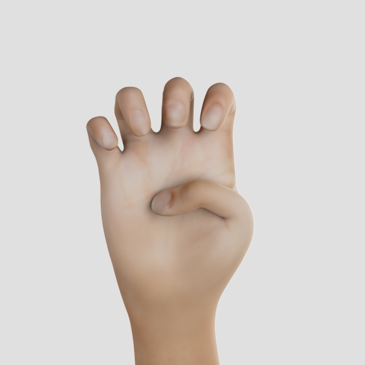
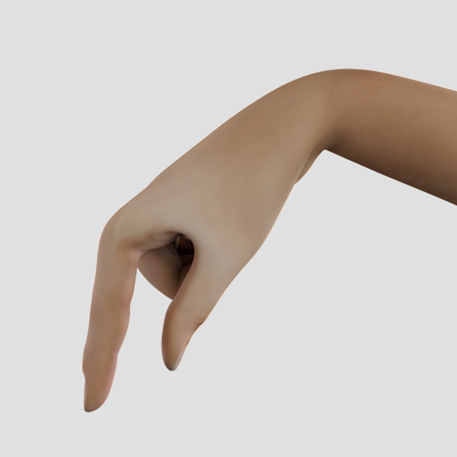
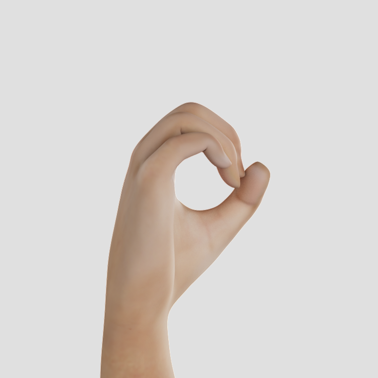
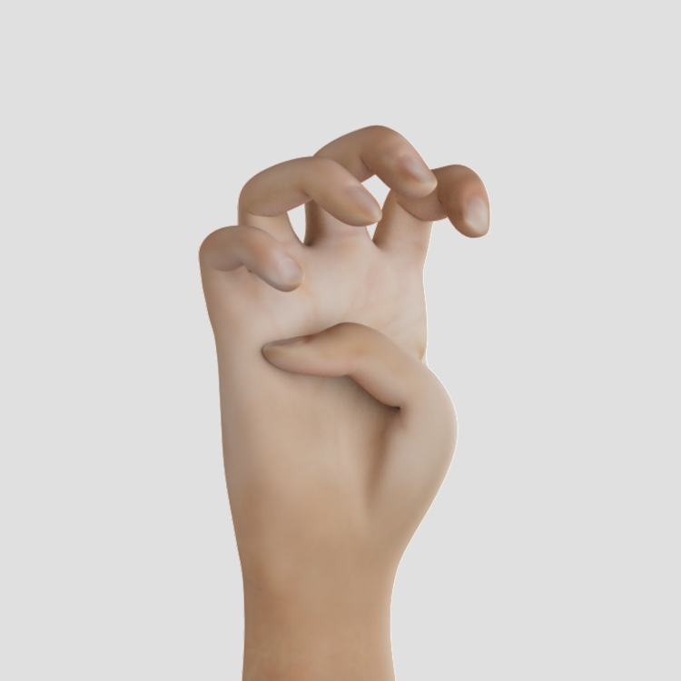
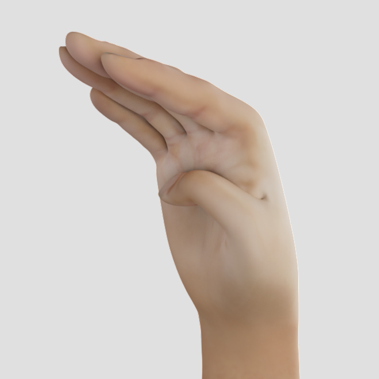
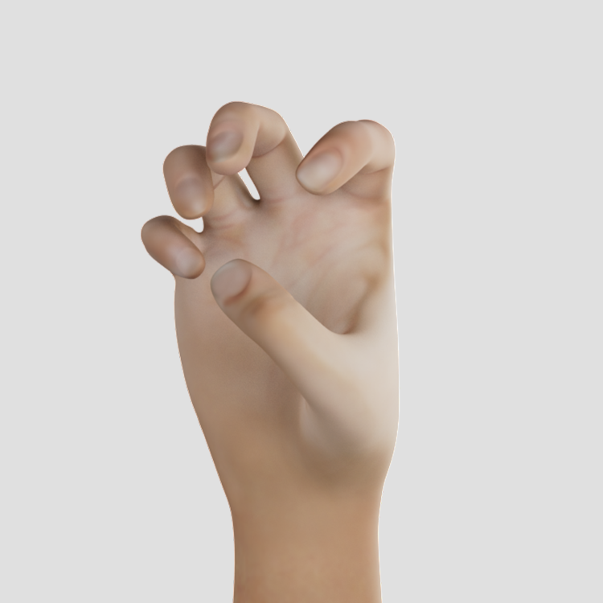
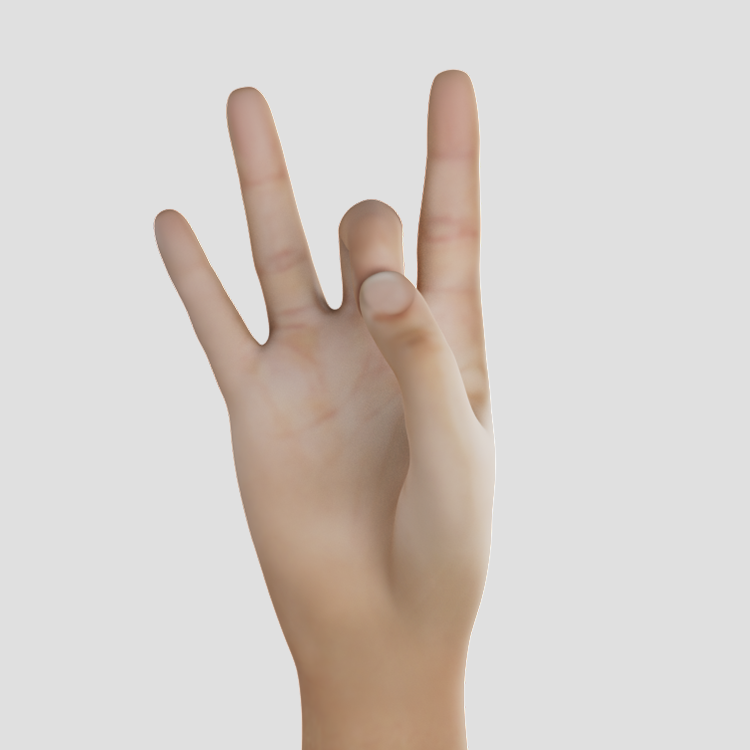
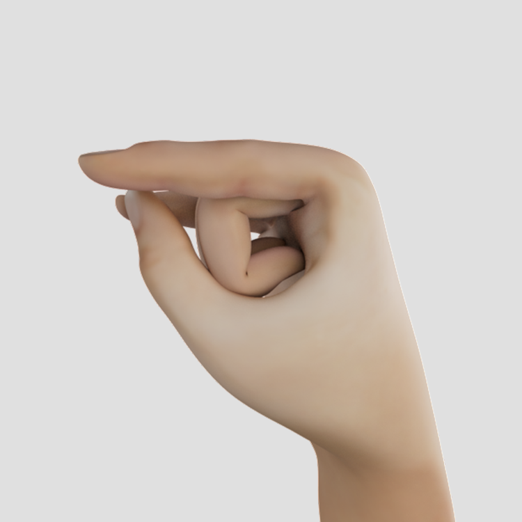

# Marked Handshapes

<table>
  <tr>
    <td></td>
    <td></td>
    <td></td>
    <td></td>
   </tr>
  <tr>
    <td>b_closed</td>
    <td>b_flat</td>
    <td>b_open</td>
    <td>d</td>
  </tr>

  <tr>
    <td></td>
    <td></td>
    <td></td>
    <td></td>
   </tr>
  <tr>
    <td>e_closed</td>
    <td>e_open_spread</td>
    <td>e_open</td>
    <td>e_spread</td>
  </tr>
  
  <tr>
    <td></td>
    <td></td>
    <td></td>
    <td></td>
   </tr>
  <tr>
    <td>e</td>
    <td>f_open</td>
    <td>f</td>
    <td>g</td>
  </tr>
  
  <tr>
    <td></td>
    <td></td>
    <td></td>
    <td></td>
   </tr>
  <tr>
    <td>h_curved</td>
    <td>h_flat</td>
    <td>h_open</td>
    <td>h</td>
  </tr>
  
  <tr>
    <td></td>
    <td></td>
    <td></td>
    <td></td>
   </tr>
  <tr>
    <td>i</td>
    <td>j</td>
    <td>k</td>
    <td>l_bent</td>
  </tr>
  
  <tr>
    <td></td>
    <td></td>
    <td></td>
    <td></td>
   </tr>
  <tr>
    <td>l_curved</td>
    <td>l</td>
    <td>m_flat</td>
    <td>m</td>
  </tr>
  
  <tr>
    <td></td>
    <td></td>
    <td></td>
    <td></td>
   </tr>
  <tr>
    <td>n_flat</td>
    <td>n</td>
    <td>o_baby</td>
    <td>o_flat</td>
  </tr>
  
  <tr>
    <td></td>
    <td></td>
    <td></td>
    <td></td>
   </tr>
  <tr>
    <td>p</td>
    <td>q</td>
    <td>r</td>
    <td>t</td>
  </tr>
  
  <tr>
    <td></td>
    <td></td>
    <td></td>
    <td></td>
   </tr>
  <tr>
    <td>u</td>
    <td>v_bent</td>
    <td>v_flat</td>
    <td>v</td>
  </tr>
  
  <tr>
    <td></td>
    <td></td>
    <td></td>
    <td></td>
   </tr>
  <tr>
    <td>w</td>
    <td>x</td>
    <td>y</td>
    <td>z</td>
  </tr>

<tr>
    <td></td>
    <td></td>
    <td></td>
    <td></td>
   </tr>
  <tr>
    <td>0</td>
    <td>1_bent</td>
    <td>1_curved</td>
    <td>1_flat</td>
  </tr>

<tr>
    <td></td>
    <td></td>
    <td></td>
    <td></td>
   </tr>
  <tr>
    <td>2</td>
    <td>3</td>
    <td>4</td>
    <td>4_curved</td>
  </tr>

<tr>
    <td></td>
    <td></td>
    <td></td>
    <td></td> 
   </tr>
  <tr>
    <td>4_flat</td>
    <td>5_curved</td>
    <td>5_flat_spread</td>
    <td>5_stacked</td>
  </tr>

<tr>
    <td></td>
    <td></td>
    <td></td>
    <td></td>
   </tr>
  <tr>
    <td>6</td>
    <td>7</td>
    <td>8</td>
    <td>8_open</td>
  </tr>

  <tr>
    <td></td>
    <td></td>
    <td></td>
    <td></td>
   </tr>
  <tr>
    <td>9</td>
    <td>goody_goody</td>
    <td>horns</td>
    <td>horns_flat</td>
  </tr>

<tr>
    <td></td>
    <td></td>
   </tr>
  <tr>
    <td>ily_flat</td>
    <td>ily</td>
  </tr>
</table>
